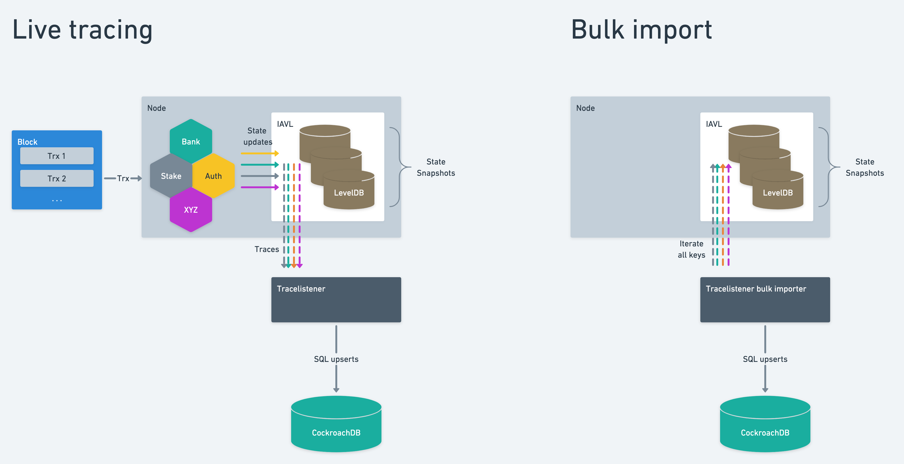
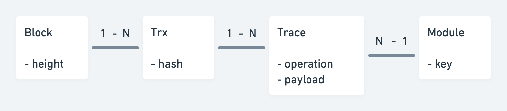

# tracelistener

[](https://codecov.io/gh/emerishq/tracelistener)
[](https://github.com/emerishq/tracelistener/commits/main)
[](https://github.com/emerishq/tracelistener/commits/main)
[](https://github.com/emerishq/tracelistener/commits/main)

## What it is

Tracelistener is a program that reads the Cosmos SDK `store` in real-time and dumps the result in a relational database, essentially creating a 1:1 copy of the data available in a module's prefix store.

The relational database of choice is CockroachDB — a Postgres protocol-compatible relational database — while the entirety of tracelistener is written in Go.

Tracelistener is a vital component of the Emeris backend, since it provides

- account balances
- staking amounts
- IBC channels, connections, clients informations

without us having to query those information from full-nodes.

By not querying full-nodes, tracelistener reduces nodes load and diminishes the chance of load-related issues — like nodes not receiving/parsing blocks due to high query amount.

Given the tightly-coupled nature of tracelistener to a Cosmos SDK node, they must be executed together on the same machine.

## Running tracelistener locally

Refer to [the dedicated page](./docs/local-dev.md).

## How it works



The Cosmos SDK has a little-known feature called **store tracing**, which tracks each and every store operation on a file.

Cosmos SDK store defines four kind of store operations:

- `write`
- `delete`
- `read`
- `iterRange`

Tracelistener is only concerned with the first two.

Each store operation is divided by a newline, and the store operation itself is serialized as JSON.

To reduce hard drive load on the hardware node which is running, tracelistener opens a UNIX named pipe (commonly referred to as FIFO) on which the Cosmos SDK node will then write store tracing lines.

### Inspecting traces

First of all launch [gaia](https://github.com/cosmos/gaia) or any Cosmos SDK
based chain node passing a FIFO as the --trace-store value:

```bash
# This example needs to be executed in two separate terminals.

# Terminal 1
mkfifo /tmp/tracelistener.fifo
gaiad start --trace-store /tmp/tracelistener.fifo

# Terminal 2
cat /tmp/tracelistener.fifo
```

In the first terminal we create a named pipe in `/tmp/tracelistener.fifo`, and then start `gaiad` with the `--trace-store`.

`gaiad` will look like it's stuck on the Tendermint initialization phase: it's normal, FIFO's block writes until there's a reader.

In the second Terminal the `cat` command starts printing JSON store tracing lines, and `gaiad` will unblock itself and resume execution.

If `cat` is killed before `gaiad`, the latter will experience a consensus failure: this is normal, and happens because it is not possible for a program to write on a closed pipe.

## Tracelistener

In a production environment, tracelistener must always be executed before the SDK node, and killed last.

For each JSON line read, tracelistener unmarshals it into a Go struct and proceeds with the parsing routine — we will refer to this object as **trace operation** from now on.

### Anatomy of a trace

```json
{
  "operation": "write",
  "key": "AWWI/l6u6S5Zhb6vAZgj4emcTZJz",
  "value": "CiAvY29zbW9zLmF...RjAtwEgutgE",
  "metadata": {
    "blockHeight": 4686332,
    "txHash": "D74A356B73A111E4977619EA22F5597F44F49B15CB5177B59846CC70744A0B4B"
  }
}
```

An incoming trace looks as above when read from the incoming Unix pipe.

- key: denotes the SDK module which generated this trace.
  It also contains other valuable information in the case of some modules (e.g. delegator addresses etc)
- value: the trace’s payload, i.e. the value to use to update the state

Each processor contains **modules**, which are entities capable of

- understanding what's inside a trace operation
- unmarshal the protobuf bytes contained in `Value`
- return a database object and `INSERT` statement to be executed

Right now there's only one processor, called \*gaia**.\***

To understand where to route each trace operation, processors look at the prefix bytes on each operation `Key`.

Each module is responsible of validating a trace operation against a well-defined set of rules, because `Key` prefixes could be shared among different Cosmos SDK modules — for example, the `0x02` prefix is used by the IBC channels module as well as the `supply` one, so the IBC channels module must be sure to not write `supply` database rows in its table.

Once a trace operation has been processed, it is batched and kept on hold until the next block arrives. This means we wait to run database queries until we receive one trace of the next block. We do this because it’s possible to receive multiple traces concerning the same row, and we want to commit to db only the final state.

Database schema is automatically migrated each time tracelistener is executed, but this behavior will change in the future.

## How a trace is born

### Overview

- An incoming new block is composed of a number of transactions.
- Each transaction can alter the internal state of a number of SDK components inside the node (change the account’s balance, unstake, etc)
- Each state alteration is an update to the node’s internal database, [IAVL](https://github.com/cosmos/iavl).
- These alterations are performed in a sequence.
  The sequence is not guaranteed by the protocol, but by the code executing on the node.
  All nodes executing the same code version, will generate the same sequence of updates.
  Each block contains an application hash which is derived by the code itself as a Merkle tree.
- IAVL intercepts the updates and generates traces. This is what we receive in Tracelistener.

### Domain model



An attempt to represent the tracing mechanism as a domain model could look as above.

### IAVL and LevelDB

IAVL is an abstraction layer above a key-value store, allowing taking snapshots of the underlying data, stored in LevelDB.

It is important to note here that the underlying DB only stores the state change information:

- module key
- operation
- payload

It does not store trx, block or execution sequence information.

### Bulk-import

When we are performing a bulk import we are reading directly from LevelDB, i.e. the latest IAVL snapshot.

The information that we load from a bulk-import is different (less) to what we receive from incoming traces.

LevelDB is missing

- trx hash
- block height

The mapping between _modules_ (i.e. IAVL tables) and Tracelistener _processors_ is as follows

- bank: `bank`
- ibc: `ibc_channels`, `ibc_clients`, `ibc_connections`
- staking: `validators`, `unbonding_delegations`
- distribution: `delegations`
- transfer: `ibc_denom_traces`
- acc: `auth`

# Module data models

Each Cosmos module is internally state machine, storing its current state in IAVL.
A trx is causing side-effects and these update the internal state.

Conceptually the different modules can be split in different categories by the “type” of internal state they maintain.

## State updates

E.g. the bank module.

Here we are simply updating a value, like setting the balance from 10 to 20.

The incoming trace event only contains the new value.

## Set updates

E.g. validator set.

Here we are inserting and deleting entries in a set of entries.

I.e.

`INSERT INTO XXX (...)`

`DELETE FROM XXX WHERE ...`
